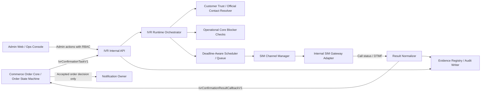

# IVR-10 - Implementation Architecture

Trạng thái: `SDS_BASELINE`  
Phase: 8 - IVR Order Confirmation  
Vai trò: Tài liệu thiết kế kiến trúc triển khai cho Phase 8, nối từ SRS `IVR-00` đến `IVR-09` sang backlog kỹ thuật.

## 1. Mục tiêu

Tài liệu này mô tả kiến trúc triển khai hệ thống IVR xác nhận đơn hàng cho Ginsengfood. Mục tiêu là làm rõ hệ thống gồm những khối nào, mỗi khối thuộc owner nào, kết nối với nhau bằng gì, dữ liệu đi qua đâu, trạng thái được sở hữu bởi ai, và điểm nào bị chặn trước khi gọi khách thật.

Tài liệu này không sinh code, không mở production, không thay thế contract trong `schemas/`, `openapi/`, `events/`, `state-machines/`. Khi có khác biệt giữa tài liệu này và SRS/contract, thứ tự ưu tiên là:

1. Source documents trong `docs/source-map.md`.
2. SRS `IVR-00` đến `IVR-09`.
3. Contract pass Phase 8.
4. SDS `IVR-10` đến `IVR-20`.

## 2. Nguồn tham chiếu

| Nguồn | Vai trò |
| --- | --- |
| `docs/source-map.md` | Danh sách đường dẫn nguồn hợp lệ. |
| `docs/documents/2. pack/09-PACK-09-IVR-ORDER-CONFIRMATION.md` | Pack governance, SIM Gateway, attempt policy, boundary. |
| `docs/documents/3. tech/10-TECH-09-IVR-ORDER-CONFIRMATION-AUTO-CALL-VERIFICATION-ANTI-FAKE-ORDER-CONTROL.md` | Technical IVR source. |
| `docs/documents/4. phase/phase-8/IVR-00-governance-source-of-truth-scope-boundary.md` | Governance và scope. |
| `docs/documents/4. phase/phase-8/IVR-02-ownership-boundary-connected-systems.md` | Connected systems và ownership. |
| `docs/documents/4. phase/phase-8/IVR-04-order-core-to-ivr-task-contract.md` | Order Core -> IVR task. |
| `docs/documents/4. phase/phase-8/IVR-05-attempt-policy-scheduler-queue.md` | Scheduler, queue, attempt policy. |
| `docs/documents/4. phase/phase-8/IVR-06-internal-sim-gateway-adapter.md` | SIM Gateway adapter boundary. |
| `docs/documents/4. phase/phase-8/IVR-07-result-normalization-order-core-callback.md` | Callback về Order Core. |
| `docs/documents/4. phase/phase-8/IVR-08-admin-monitoring-evidence-audit-privacy.md` | Admin, evidence, audit, privacy. |
| `docs/documents/4. phase/phase-8/IVR-09-test-matrix-smoke-release-gate.md` | Smoke và release gate. |

## 3. Kiến trúc logic

## 4. Khối triển khai

| Khối | Trách nhiệm | Owner | Không được làm |
| --- | --- | --- | --- |
| Order Core IVR Task Publisher | Tạo `IvrConfirmationTaskV1` cho Official Order đủ điều kiện. | Commerce Order Core | Không giao task cho Quote/Cart/Order Draft. |
| IVR Internal API | Nhận task, callback, admin action; validate auth/idempotency/schema. | Business Platform IVR | Không mở public consumer API. |
| IVR Runtime Orchestrator | Điều phối CallJob, Attempt, Result, callback, technical exception. | Business Platform IVR | Không transition order. |
| Eligibility Service | Kiểm official order, trusted skip, official contact, phone validation, policy block. | Business Platform với source owner | Không hardcode trusted customer. |
| Deadline-Aware Scheduler | Lên lịch attempt theo Golden Hour/24/7, ưu tiên deadline. | IVR Runtime | Không gọi ngoài window. |
| SIM Channel Manager | Quản lý 1 SIM = 1 active outbound call, health, reserve/release. | IVR Infrastructure | Không assign trùng SIM. |
| Internal SIM Gateway Adapter | Dial, play script, capture DTMF/call disposition. | IVR Infrastructure | Không có quyền update order. |
| Result Normalizer | Chuẩn hóa raw result thành enum/source-backed result. | IVR Runtime | Không biến lỗi kỹ thuật thành no-answer. |
| Order Core Callback Client | Gửi callback idempotent về Order Core. | IVR Runtime | Không retry vô hạn. |
| Evidence/Audit Writer | Ghi audit/evidence refs cho task/attempt/result/admin/incident. | Foundation/Evidence | Không tự mark release PASS. |
| Admin IVR Console | Monitor queue, pause/resume, disable SIM, manual technical retry, review. | Admin/Ops | Không bypass Sale Lock/Recall/Suppression. |

## 5. Kiến trúc triển khai runtime

Phase 8 nên triển khai theo từng lớp:

| Lớp | Nội dung | Ghi chú |
| --- | --- | --- |
| Contract layer | Schema/OpenAPI/events/state machines đã có trong repo contract. | Không gọi khách thật. |
| Persistence layer | Bảng IVR task/job/attempt/result/callback/SIM/incident/admin action. | Không lưu raw phone nếu không có policy. |
| Application service layer | Intake, eligibility, scheduler, result normalizer, callback, admin action. | Có unit/integration tests. |
| Adapter layer | SIM Gateway adapter fake/internal, Order Core client, Operational Core client, Evidence client. | Production SIM bị feature flag chặn. |
| Admin layer | Dashboard, queue, SIM, incident, review, evidence view. | RBAC server-side. |
| Release layer | Smoke, UAT, evidence packet, real-call gate. | `REAL_CUSTOMER_CALL_ALLOWED = false` đến khi pass. |

## 6. Deployment model

Mô hình V1 là `INTERNAL_SIM_GATEWAY_SERVER`.

| Thành phần | Deployment khuyến nghị | Ghi chú |
| --- | --- | --- |
| IVR Internal API | Backend service trong business-platform boundary | Chỉ internal/admin auth. |
| IVR Runtime Worker | Worker service riêng hoặc hosted background worker | Tách khỏi request thread. |
| Scheduler | Background worker có distributed lock | Không phụ thuộc timer trong UI. |
| SIM Gateway Adapter | Adapter service gần SIM Gateway server | Không expose credential ra app. |
| Admin Web | Admin/Ops console | Chỉ gọi admin API. |
| Evidence/Audit | Dùng foundation evidence/audit writer | Không tự tạo PASS. |

## 7. Data ownership

| Dữ liệu | Owner ghi | Owner đọc | Quy tắc |
| --- | --- | --- | --- |
| Order state | Order Core | IVR đọc qua task/callback ack | IVR không ghi. |
| IVR task/job/attempt/result | IVR Runtime | Admin, Order Core theo boundary | Có idempotency/audit. |
| Official contact projection | Customer/Commerce owner | IVR dùng projection/token | Không full profile. |
| Operational blockers | Operational Core | Order Core/IVR check | Block thắng IVR. |
| Evidence/audit | Evidence/Foundation | Owner/admin/release | Không sửa evidence đã accepted. |
| SIM channel health | IVR Infrastructure | Scheduler/Admin | Không chứa order PII ngoài refs. |

## 8. Runtime invariants

- Golden Hour: đúng 2 customer-counted attempts trong 10 phút.
- 24/7: đúng 3 customer-counted attempts trong 15 phút.
- Technical retry không tăng customer attempt count.
- IVR result là input signal, không phải order decision.
- Order Core revalidate trước mọi transition.
- Sale Lock/Recall/Suppression/opt-out/policy block thắng IVR.
- No-answer max không tự gửi notification.
- Real customer call bị chặn đến khi release gate pass.

## 9. Failure architecture

| Failure | Xử lý |
| --- | --- |
| Order Core unavailable | Không tạo task mới; callback retry bounded; escalate nếu hết retry. |
| Operational Core unavailable | Không dispatch attempt; hold/admin review. |
| Evidence unavailable | Không callback final để order transition; technical exception/admin review. |
| SIM unavailable | Technical exception; không count customer attempt. |
| Queue quá tải | Capacity incident; không kéo dài window thương mại. |
| Callback stale | Order Core reject stale; IVR đóng result theo `CALLBACK_REJECTED_STALE`. |

## 10. Acceptance criteria

- Kiến trúc chỉ rõ tất cả connected systems và quyền của từng hệ thống.
- Có ranh giới rõ giữa Order Core, IVR Runtime, SIM Adapter, Operational Core, Evidence, Admin.
- Không có đường nào cho IVR hoặc SIM Adapter ghi order state trực tiếp.
- Có chiến lược worker/scheduler thay vì xử lý call trong request thread.
- Có fail-safe cho mọi dependency chính.
- Có production hard gate trước real customer call.
