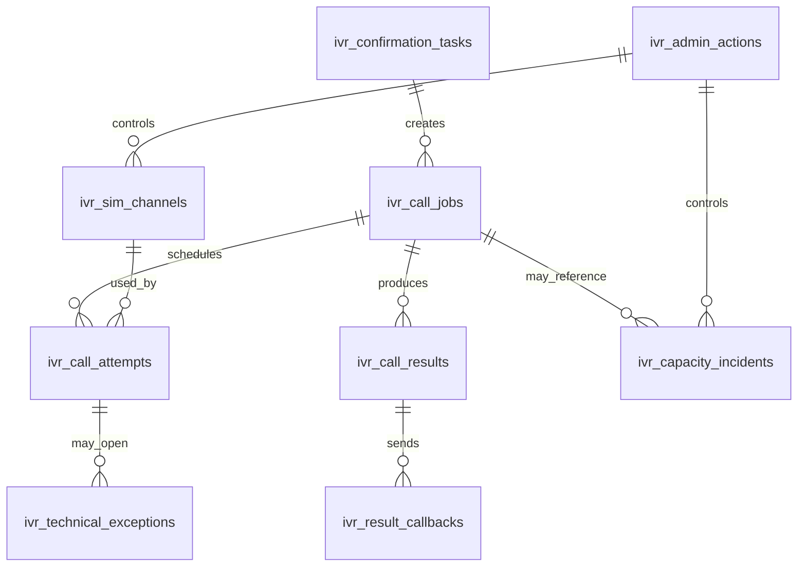

# IVR-12 - Database Design

Trạng thái: `SDS_BASELINE`  
Phase: 8 - IVR Order Confirmation  
Vai trò: Thiết kế dữ liệu triển khai cho IVR task, job, attempt, result, callback, SIM, incident, exception, admin action.

## 1. Mục tiêu

Tài liệu này mô tả database model đề xuất cho Phase 8 IVR. Thiết kế tập trung vào traceability, idempotency, audit/evidence, state machine, privacy, và race-condition guard. Tên bảng là đề xuất triển khai; implementation có thể điều chỉnh theo convention của repo nhưng không được làm mất semantic contract.

## 2. Nguyên tắc dữ liệu

- Không lưu raw phone nếu không có privacy decision được duyệt.
- Dùng `phone_ref`, `phone_masked`, hoặc dial token có TTL.
- Mọi command rủi ro phải có idempotency key.
- Mọi state transition quan trọng phải có audit/evidence refs.
- Technical failure không được cộng vào customer attempt count.
- Order state không nằm trong IVR DB như source-of-truth; chỉ lưu snapshot/version để revalidate.
- Soft delete không được che audit trail.
- Retention phải tách theo loại dữ liệu: task/job/attempt/result/call log/DTMF/admin audit/recording.

## 3. Entity relationship

## 4. Bảng `ivr_confirmation_tasks`

Mục tiêu: Lưu task Order Core gửi sang IVR.

| Column | Type semantic | Required | Index | Ghi chú |
| --- | --- | --- | --- | --- |
| `id` | uuid/string | Có | PK | Internal id. |
| `task_id` | string | Có | Unique | Contract id từ Order Core. |
| `version` | string | Có |  | `v1`. |
| `idempotency_key` | string | Có | Unique scoped | Chống duplicate task. |
| `correlation_id` | string | Có | Index | Trace. |
| `official_order_id` | string | Có | Index | Không phải source-of-truth. |
| `order_code` | string | Có điều kiện |  | Display/audit. |
| `order_version` | string | Có | Index | Race guard. |
| `customer_id` | string | Có điều kiện | Index | Không lưu full profile. |
| `program_type` | string | Có | Index | `GOLDEN_HOUR`/`TWENTY_FOUR_SEVEN`. |
| `max_attempts` | int | Có |  | 2 hoặc 3 theo program. |
| `confirmation_window_seconds` | int | Có |  | 600 hoặc 900. |
| `official_contact_id` | string | Có | Index | Contact được duyệt. |
| `phone_ref` | string | Có |  | Secure reference. |
| `phone_masked` | string | Có |  | Admin-safe. |
| `phone_validation_status` | string | Có | Index | Không unknown khi dispatch thật. |
| `eligibility_decision` | string | Có | Index | Enum Phase 8. |
| `blocked_reasons_json` | json | Có |  | Danh sách block. |
| `not_for_quote_cart_draft` | bool | Có |  | Must be true. |
| `no_direct_order_update` | bool | Có |  | Must be true. |
| `created_at` | datetime | Có | Index | Server time. |
| `expires_at` | datetime | Có | Index | Program window. |
| `accepted_at` | datetime | Không |  | Khi IVR accepted. |
| `rejected_at` | datetime | Không |  | Khi reject. |
| `reject_reason` | string | Không |  | Machine-readable. |
| `evidence_refs_json` | json | Không |  | Evidence refs. |
| `audit_refs_json` | json | Không |  | Audit refs. |

Constraints:

- Unique `(task_id)`.
- Unique `(idempotency_key)` trong scope task intake.
- Check `program_type = GOLDEN_HOUR` thì `max_attempts = 2`, `confirmation_window_seconds = 600`.
- Check `program_type = TWENTY_FOUR_SEVEN` thì `max_attempts = 3`, `confirmation_window_seconds = 900`.

## 5. Bảng `ivr_call_jobs`

Mục tiêu: Lưu lifecycle CallJob.

| Column | Type semantic | Required | Index | Ghi chú |
| --- | --- | --- | --- | --- |
| `id` | uuid/string | Có | PK | Internal id. |
| `ivr_call_job_id` | string | Có | Unique | Contract id. |
| `task_id` | string | Có | FK/index | Link task. |
| `official_order_id` | string | Có | Index | Snapshot ref. |
| `order_version` | string | Có |  | Race guard. |
| `program_type` | string | Có | Index | Program. |
| `attempt_policy_code` | string | Có |  | Policy version/code. |
| `status` | string | Có | Index | `ivr-call-job-status`. |
| `max_attempts` | int | Có |  | Customer-counted limit. |
| `attempt_spacing_seconds` | int | Có |  | 300 baseline. |
| `confirmation_window_seconds` | int | Có |  | 600/900. |
| `attempt_schedule_json` | json | Có |  | Planned offsets/time. |
| `eligible` | bool | Có | Index | Latest eligibility. |
| `eligibility_decision` | string | Có | Index | Latest decision. |
| `queue_status` | string | Có | Index | Active/paused/held. |
| `capacity_incident_id` | string | Không | Index | Link incident. |
| `script_version` | string | Có |  | Approved script. |
| `privacy_policy_version` | string | Có |  | Applied privacy rule. |
| `input_signal_only` | bool | Có |  | Must be true. |
| `no_direct_order_update` | bool | Có |  | Must be true. |
| `created_at` | datetime | Có | Index |  |
| `closed_at` | datetime | Không | Index |  |
| `closed_reason` | string | Không |  |  |
| `evidence_refs_json` | json | Không |  |  |
| `audit_refs_json` | json | Không |  |  |

Indexes:

- `(status, expires_at)` hoặc equivalent projection để scheduler query deadline.
- `(program_type, status)`.
- `(official_order_id, status)`.

## 6. Bảng `ivr_call_attempts`

Mục tiêu: Lưu từng attempt và phân biệt customer-counted với technical retry.

| Column | Type semantic | Required | Index | Ghi chú |
| --- | --- | --- | --- | --- |
| `id` | uuid/string | Có | PK |  |
| `ivr_call_attempt_id` | string | Có | Unique | Contract id. |
| `ivr_call_job_id` | string | Có | FK/index | Parent job. |
| `task_id` | string | Có | Index | Parent task. |
| `attempt_number` | int | Có | Index | Customer attempt number. |
| `program_type` | string | Có |  |  |
| `scheduled_at` | datetime | Có | Index |  |
| `scheduled_window_expires_at` | datetime | Có | Index |  |
| `started_at` | datetime | Không |  |  |
| `ended_at` | datetime | Không |  |  |
| `status` | string | Có | Index | `ivr-call-attempt-status`. |
| `result_status` | string | Không | Index | `ivr-result-status`. |
| `dtmf_key` | string | Không |  | `1`, `0`, invalid, null. |
| `is_counted_customer_attempt` | bool | Có | Index | False for technical retry. |
| `technical_retry_allowed` | bool | Có |  |  |
| `technical_retry_count` | int | Có |  |  |
| `no_answer` | bool | Có |  |  |
| `invalid_phone` | bool | Có |  |  |
| `technical_exception_type` | string | Không | Index |  |
| `sim_channel_id` | string | Không | Index |  |
| `provider_call_id` | string | Không | Index | If available. |
| `blocked_reason` | string | Không |  |  |
| `policy_version` | string | Có |  |  |
| `script_version` | string | Có |  |  |
| `evidence_refs_json` | json | Không |  |  |
| `audit_refs_json` | json | Không |  |  |

Constraints:

- Unique `(ivr_call_job_id, attempt_number)` for customer-counted attempts.
- `is_counted_customer_attempt = false` when `technical_exception_type` is not null.
- Golden Hour must not create attempt_number > 2.
- 24/7 must not create attempt_number > 3.

## 7. Bảng `ivr_call_results`

Mục tiêu: Lưu normalized result.

| Column | Type semantic | Required | Index | Ghi chú |
| --- | --- | --- | --- | --- |
| `id` | uuid/string | Có | PK |  |
| `ivr_call_result_id` | string | Có | Unique | Contract id. |
| `ivr_call_job_id` | string | Có | FK/index |  |
| `task_id` | string | Có | Index |  |
| `official_order_id` | string | Có | Index |  |
| `order_version_seen_by_ivr` | string | Có |  | Race guard. |
| `final_result_status` | string | Có | Index |  |
| `result_type` | string | Có | Index |  |
| `result_reason` | string | Không |  |  |
| `dtmf_key` | string | Không |  |  |
| `is_counted_customer_attempt` | bool | Có |  |  |
| `is_final_for_ivr` | bool | Có | Index |  |
| `recommended_core_action` | string | Có |  | Advisory only. |
| `core_order_handoff_required` | bool | Có |  |  |
| `human_review_required` | bool | Có | Index |  |
| `input_signal_only` | bool | Có |  | Must be true. |
| `no_direct_order_update` | bool | Có |  | Must be true. |
| `no_payment_or_revenue_effect` | bool | Có |  | Must be true. |
| `technical_error_code` | string | Không |  |  |
| `created_at` | datetime | Có | Index |  |
| `evidence_refs_json` | json | Không |  |  |
| `audit_refs_json` | json | Không |  |  |

## 8. Bảng `ivr_result_callbacks`

Mục tiêu: Theo dõi callback IVR -> Order Core.

| Column | Type semantic | Required | Index | Ghi chú |
| --- | --- | --- | --- | --- |
| `callback_id` | string | Có | PK/Unique | Contract id. |
| `ivr_call_result_id` | string | Có | FK/index |  |
| `task_id` | string | Có | Index |  |
| `official_order_id` | string | Có | Index |  |
| `idempotency_key` | string | Có | Unique scoped |  |
| `result_status` | string | Có | Index |  |
| `result_state` | string | Có | Index |  |
| `requires_core_revalidation` | bool | Có |  | Must be true. |
| `sent_at` | datetime | Không | Index |  |
| `acknowledged_at` | datetime | Không |  |  |
| `core_response_code` | string | Không | Index | Accepted/stale/blocked/review. |
| `retry_count` | int | Có |  | Bounded. |
| `last_retry_at` | datetime | Không |  |  |
| `next_retry_at` | datetime | Không | Index |  |
| `last_error` | string | Không |  | Sanitized. |

## 9. Bảng vận hành phụ trợ

| Bảng | Mục tiêu | Field chính |
| --- | --- | --- |
| `ivr_sim_channels` | Quản lý SIM channel, health, enabled/disabled. | `sim_channel_id`, `enabled`, `status`, `last_health_check_at`, `active_call_job_id`, `disabled_reason`. |
| `ivr_capacity_incidents` | Quản lý capacity incident. | `capacity_incident_id`, `status`, `scope`, `hold_new_calls`, `opened_at`, `resolved_at`, `reason`. |
| `ivr_technical_exceptions` | Lưu lỗi kỹ thuật không count attempt. | `technical_exception_id`, `exception_type`, `customer_attempt_counted=false`, `technical_retry_allowed`. |
| `ivr_admin_actions` | Lưu admin action có permission/evidence. | `admin_action_id`, `action_type`, `permission`, `actor_id`, `target_type`, `target_id`, `reason`. |
| `ivr_evidence_links` | Optional link table nếu evidence refs cần query. | `owner_table`, `owner_id`, `evidence_ref`, `audit_ref`. |

## 10. Outbox và event

AsyncAPI hiện chỉ map message/channel/ref. Vì broker/topic/retry/outbox chưa có approved toolchain, database design không bắt buộc tạo outbox production trong Phase 8 baseline.

Nếu implementation đã có outbox chuẩn trong repo, IVR được phép dùng lại với điều kiện:

- Không tự định nghĩa broker/topic mới ngoài standard.
- Event payload khớp `events/business-platform/ivr/*`.
- Outbox không thay thế callback Order Core.
- Outbox retry không tạo duplicate order transition.

## 11. Retention và privacy

| Dữ liệu | Retention mặc định | Ghi chú |
| --- | --- | --- |
| Task/job/result/callback metadata | Owner Decision Required | Cần đủ audit/release trace. |
| Call log kỹ thuật | Owner Decision Required | Sanitized, không raw PII nếu không cần. |
| DTMF evidence | Owner Decision Required | Chỉ lưu key/result, không lưu sensitive content. |
| Recording | Owner Decision Required | Không bật recording nếu chưa được duyệt. |
| Admin audit | Theo foundation audit policy | Không sửa/xóa thủ công. |
| Raw phone/token | TTL ngắn nhất có thể | Ưu tiên token/ref/masked. |

## 12. Migration gates

Trước khi merge migration:

- Không có column bắt buộc lưu full phone/raw recording nếu chưa có owner decision.
- Có unique index cho idempotency/task/callback.
- Có index cho scheduler query.
- Có constraints hoặc application guard cho max attempts.
- Có migration rollback hoặc forward-fix plan.
- Có seed tối thiểu cho SIM channel chỉ ở non-production hoặc disabled state.

## 13. Acceptance criteria

- Database model bao phủ task, job, attempt, result, callback, SIM, incident, technical exception, admin action.
- Có constraints chống Golden Hour attempt 3 và 24/7 attempt 4.
- Có idempotency/correlation/race guard.
- Có audit/evidence linkage.
- Có privacy boundary cho phone/recording/call log.
- Không có bảng/column nào cho phép IVR sở hữu order state.
