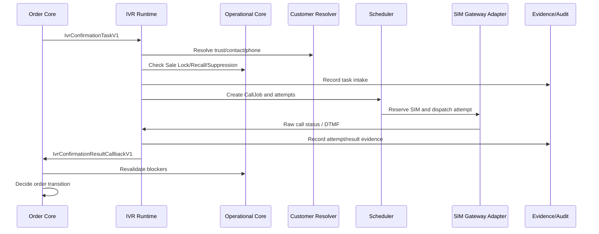

# IVR-14 - Workflow Orchestration

Trạng thái: `SDS_BASELINE`  
Phase: 8 - IVR Order Confirmation  
Vai trò: Thiết kế workflow triển khai cho các luồng IVR chính, bao gồm happy path, cancel, no-answer, invalid phone, technical failure, race condition, capacity hold và admin action.

## 1. Mục tiêu

Tài liệu này mô tả thứ tự xử lý end-to-end. Workflow phải giúp dev/backend/admin/test hiểu khi nào tạo task, khi nào queue, khi nào gọi, khi nào callback, và khi nào dừng.

## 2. Workflow tổng quát

## 3. Workflow A - Khách xác nhận bằng phím `1`

Điều kiện đầu vào:

- Official Order đủ điều kiện.
- Không trusted skip.
- Official phone valid.
- Không Sale Lock/Recall/Suppression/opt-out.
- Release mode cho phép loại call tương ứng. Với production, chỉ sau IVR-09 pass.

Luồng:

1. Order Core tạo `IvrConfirmationTaskV1`.
2. IVR intake, ghi task, tạo CallJob.
3. Scheduler tạo attempt theo program.
4. SIM Adapter gọi khách.
5. Khách nghe và bấm `1`.
6. Result Normalizer tạo `IVR_CONFIRMED`.
7. IVR ghi evidence/audit.
8. IVR callback Order Core.
9. Order Core revalidate:
   - Order version.
   - Order state.
   - Sale Lock/Recall/Suppression/opt-out.
   - Payment issue.
   - Evidence/audit.
10. Nếu pass, Order Core mới transition theo state machine.

Blocked:

- IVR không được tự set order confirmed.
- Admin không được force confirm từ IVR console.

## 4. Workflow B - Khách hủy bằng phím `0`

Luồng:

1. Khách nghe và bấm `0`.
2. Result Normalizer tạo `IVR_CUSTOMER_CANCELLED`.
3. Callback gửi Order Core với `recommended_core_action = CORE_REVALIDATE_AND_CANCEL_CUSTOMER_REQUEST`.
4. Order Core revalidate.
5. Nếu policy cho phép, Order Core hủy đơn qua state machine.
6. Notification owner chỉ gửi thông báo sau khi Order Core đã hủy chính thức.

Blocked:

- SIM Adapter không gửi SMS hủy.
- IVR không update order cancelled.
- No-answer hoặc technical failure không được map thành customer cancelled.

## 5. Workflow C - No-answer theo program

Golden Hour:

| Attempt | Thời điểm | Nếu không nghe |
| --- | --- | --- |
| 1 | `T0` | Lên attempt 2 ở `T0 + 5`. |
| 2 | `T0 + 5` | Tạo `IVR_NO_ANSWER_FINAL`. |

24/7:

| Attempt | Thời điểm | Nếu không nghe |
| --- | --- | --- |
| 1 | `T0` | Lên attempt 2 ở `T0 + 5`. |
| 2 | `T0 + 5` | Lên attempt 3 ở `T0 + 10`. |
| 3 | `T0 + 10` | Tạo `IVR_NO_ANSWER_FINAL`. |

Luồng final:

1. Final no-answer được ghi là result.
2. IVR callback Order Core.
3. Order Core revalidate.
4. Order Core quyết định cancel/expire/hold theo policy.
5. Notification không tự gửi từ IVR.

## 6. Workflow D - Invalid phone

Invalid phone xảy ra khi:

- Phone missing.
- Format invalid.
- Không phải official contact.
- Opt-out/suppression.
- Owner resolver xác nhận invalid.

Luồng:

1. Eligibility/phone validation phát hiện invalid.
2. Không dispatch SIM.
3. Result hoặc eligibility decision là `INVALID_PHONE_FINAL` hoặc `BLOCK_INVALID_PHONE`.
4. Callback/handoff về Order Core nếu cần.
5. Order Core quyết định hold/cancel/review.

Không được:

- Tính invalid phone là no-answer.
- Gọi phone khác nếu không có official contact policy.
- Gọi full customer profile resolver vượt quyền.

## 7. Workflow E - Technical failure

Technical failure gồm:

- SIM Gateway error.
- SIM channel failure.
- Server/scheduler error.
- DTMF capture error.
- Audio playback error.
- Evidence write error.
- Callback technical error.
- Phone validation technical error.

Luồng:

1. Service phát hiện technical exception.
2. Ghi `IvrTechnicalException`.
3. `customer_attempt_counted = false`.
4. Nếu policy cho phép, tạo technical retry.
5. Nếu không, route admin review.
6. Không tạo no-answer/cancel.

## 8. Workflow F - Race condition sau khi khách bấm `1`

Tình huống: Khách bấm `1`, nhưng trước khi Order Core accept callback, đơn bị Sale Lock/Recall/payment issue.

Luồng bắt buộc:

1. IVR vẫn giữ raw customer signal là `IVR_CONFIRMED`.
2. Callback gửi Order Core kèm `order_version_seen_by_ivr`.
3. Order Core phát hiện blocker/version mismatch.
4. Order Core trả `CALLBACK_BLOCKED_BY_CORE` hoặc `CALLBACK_REJECTED_STALE`.
5. Order không được confirm chỉ vì đã bấm `1`.
6. Evidence phải link cả IVR signal và blocker.

## 9. Workflow G - Trusted customer skip

Luồng:

1. Order Core gọi trust resolver.
2. Nếu trusted skip allowed và không có risk flags, không tạo call job.
3. Ghi eligibility decision `SKIP_TRUSTED_CUSTOMER`.
4. Order Core tiếp tục workflow theo policy của Order Core.

Không được:

- IVR tự hardcode trusted customer.
- Admin tự mark trusted để skip.
- Trusted skip bỏ qua Sale Lock/Recall/Suppression.

## 10. Workflow H - Capacity hold

Luồng:

1. Capacity monitor phát hiện queue/SIM risk.
2. Mở `IvrCapacityIncident`.
3. Scheduler dừng dispatch mới nếu incident yêu cầu hold.
4. Admin/Ops xem incident, pause/resume nếu có permission.
5. Window thương mại không được kéo dài vì capacity.
6. Attempt miss window phải đi về expired/no final signal theo policy.

## 11. Workflow I - Admin manual technical retry

Luồng:

1. Technical exception được mở.
2. Admin có `IVR_MANUAL_RETRY` xem evidence.
3. Admin gửi action có reason.
4. Service kiểm retry không vượt policy, không bypass blocker.
5. Retry được đánh dấu technical, không tăng customer attempt.
6. Ghi audit/evidence.

Blocked:

- Manual retry không được gọi khách nếu release gate chặn.
- Manual retry không được tạo attempt thứ 3 cho Golden Hour như customer attempt.
- Manual retry không được bypass opt-out/Sale Lock/Recall.

## 12. Workflow acceptance matrix

| Scenario | Expected outcome |
| --- | --- |
| Quote/Cart/Draft | Không tạo IVR task. |
| Official Order untrusted | Tạo task nếu không có blocker. |
| Trusted skip | Không gọi IVR, ghi decision. |
| Phone invalid | Không gọi, không no-answer. |
| Technical error | Technical exception, không count attempt. |
| Golden Hour no answer 2 lần | Final no-answer, callback Core. |
| 24/7 no answer 3 lần | Final no-answer, callback Core. |
| Khách bấm `1` nhưng Sale Lock xuất hiện | Core block/hold, không auto confirm. |
| Khách bấm `0` | Core revalidate rồi mới cancel. |
| Queue paused | Không dispatch attempt mới. |

## 13. Acceptance criteria

- Có workflow cho mọi happy path và failure path quan trọng.
- Mọi workflow đều kết thúc ở Order Core decision hoặc admin/evidence review.
- Không workflow nào cho phép IVR/SIM tự update order.
- Race condition có xử lý rõ bằng order version và revalidation.
- Capacity và technical retry không phá attempt policy.
